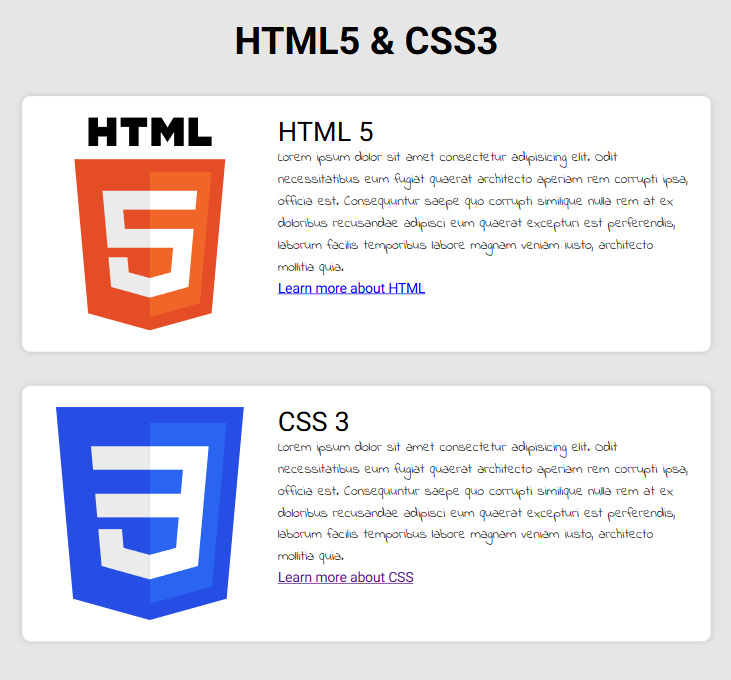
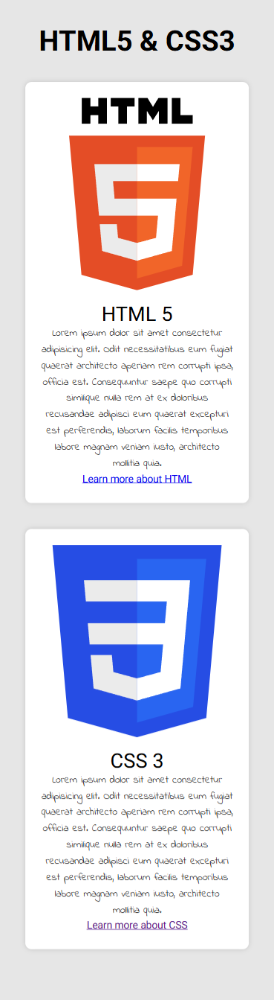

# F5 Exercise - HTML5 & CSS3: FlexBox

### Enlace a sitio web: 
[GitHub Pages](https://danielmuntyanu.github.io/ex-html-css-frontend-reproduce-using-flexbox/)

 

## Etapas:
1. ✅ Escribir un plan de proyecto.
    1. ✅ Crear un repositorio locál.
2. ✅ Crear estructura de proyecto:
    1. ✅ Cambiar la rama `main` a `dev`.
    2. ✅ Crear archivos `index.html` y `css/styles.css`.
    3. ✅ Crear la carpeta `assets/` con `images/` y `fonts/`
    4. ✅ Push a GitHub repositorio público. 
3. ✅ Averiguar que elementos se necesitan, añadir la estructura.
    - solamente a `index.html`.
    - sin ningún estilo.
4. ✅ Añadir contenido (textos, imagenes).
    1. ✅ Encontrar los imagenes.
    2. ✅ Crear los textos en "Lorum ipsum..."
    - solamente a `index.html`.
    - sin ningún estilo.
4. ✅ Crear CSS classes de contenedores y de elementos que se repiten.
    1. ✅ Añadir los a `index.html`.
    2. ✅ Añadir los a `styles.css`.
5. ✅ Trabajar en estructura y flexbox para vista `mobile` y `desktop`.
    1. ✅ Usar Google Chrome developer tools. 
    2. ✅ Añadir el código a `styles.css` despues. 
6. ✅ Añadir los fuentes y los estilos de tipografía. 
    1. ✅ Usar Google Fonts.
    2. ✅ Descargarlos a carpeta `assets/fonts`.
    3. ✅ Añadir con `font-face` en `styles.css`.
7. ✅ Añadir los estilos de contenedores y fondo.
8. ✅ Comprobar y corregir todo el sitio web.
9. ✅ Merge la rama `dev` con `main`.
10. ✅ Despliegue a GitHub Pages.

    

# Exercise - HTML5 & CSS3 - Frontend - Reproduce using Flexbox

## Instrucciones

Reproduce la siguiente imagen utilizando **HTML** y **CSS**.  
Utiliza como texto un **lorem ipsum**.

### Requisito
- Usar flexbox.
- Debes utilizar una fuente de [Google Fonts](https://fonts.google.com/).
- Enlace a "Learn more about HTML" (https://lenguajehtml.com/html/)
- Enlace a "Learn more about CSS" (https://lenguajecss.com/css/)

  
  

